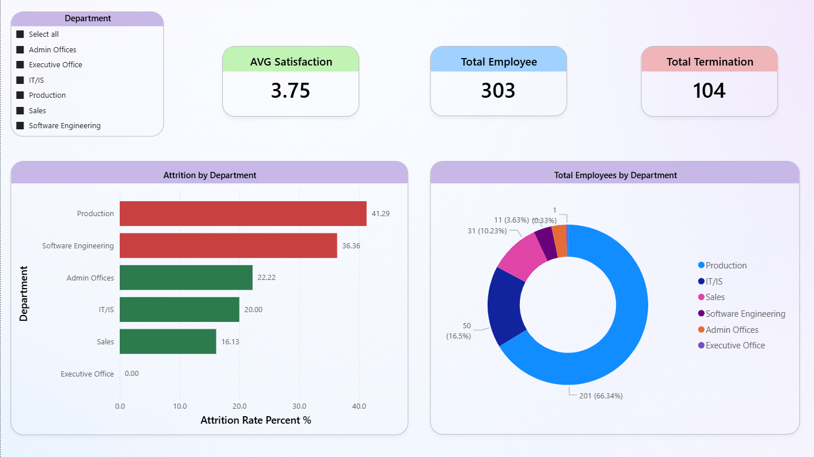
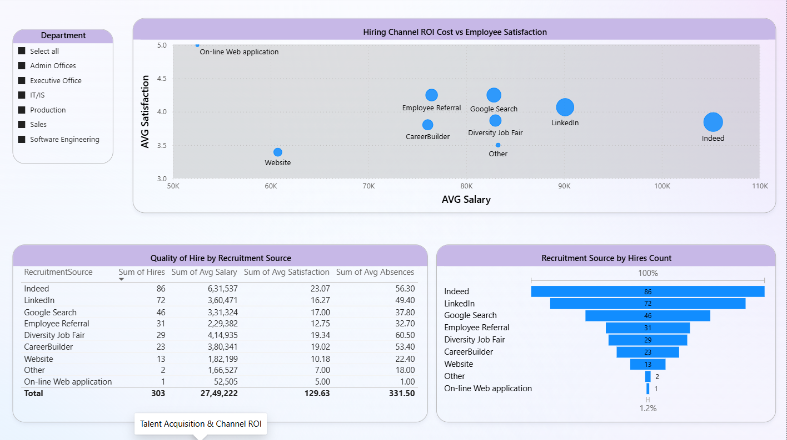
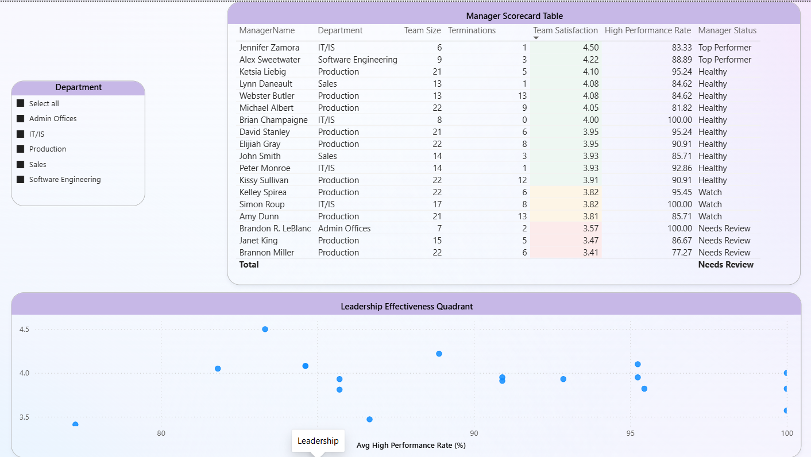
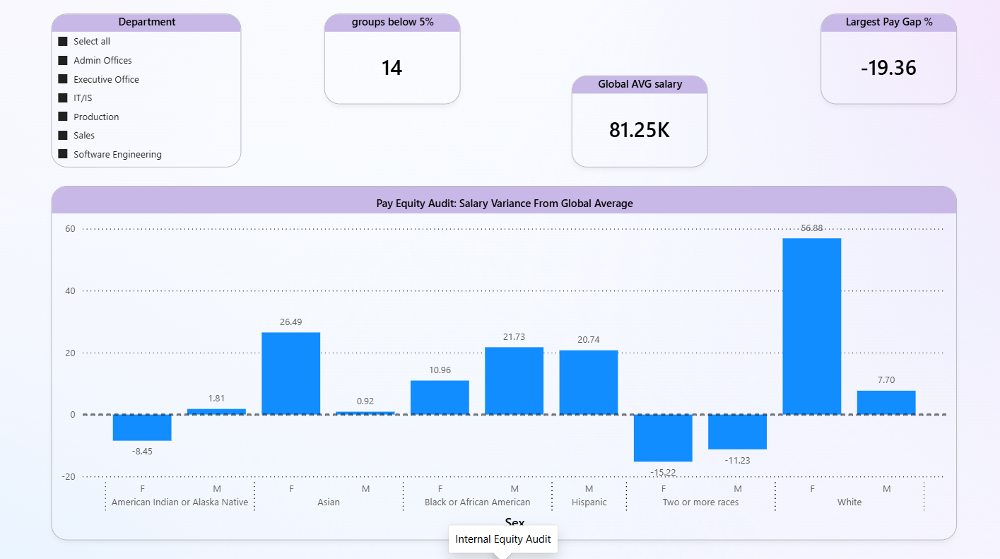

# 👥 HR Analytics Dashboard — Workforce Intelligence Report

A end-to-end HR analytics project built on a real 311-employee dataset. Raw data was queried and aggregated in **MySQL**, piped into **Power BI** as views, and visualised across a 5-page interactive dashboard. The project answers five core HR questions around attrition, recruitment quality, leadership effectiveness, pay equity, and retention risk.

---

## 📌 Project Overview

| Detail | Info |
|--------|------|
| **Dataset** | HRDataset_v14 — 311 employees |
| **Tools** | MySQL · Power BI · DAX |
| **Data pipeline** | Raw CSV → MySQL Views → Power BI |
| **Dashboard pages** | 5 pages |
| **SQL queries** | 5 views + 2 bridge views |

---

## 🎯 Business Questions Answered

| # | Question | Page |
|---|----------|------|
| 1 | Which departments are losing the most staff? | Attrition Risk |
| 2 | Which recruitment channels produce the most satisfied, highest-quality hires? | Talent Acquisition & Channel ROI |
| 3 | Which managers may need leadership support based on team metrics? | Leadership |
| 4 | Are there salary disparities across race and gender groups? | Internal Equity Audit |
| 5 | Which high performers are underpaid or disengaged and at flight risk? | Talent Spotlight & Retention Risk |

---

## 🗄️ Data Pipeline

```
HRDataset_v14.csv
       │
       ▼
   MySQL Database
       │
       ├── VIEW: attrition_by_dept
       ├── VIEW: recruitment_source
       ├── VIEW: manager_scorecard
       ├── VIEW: pay_equity
       ├── VIEW: star_employees
       ├── VIEW: dim_department  (bridge)
       └── VIEW: dim_sex         (bridge)
       │
       ▼
  Power BI Desktop
  (Get Data → MySQL Database)
       │
       ▼
  5-Page Interactive Dashboard
```

Each view was created in MySQL so Power BI receives clean, pre-aggregated tables. This separates the transformation logic (SQL) from the visualisation layer (Power BI) — the way a real analyst pipeline works.

---

## 🗃️ SQL Views

### View 1 — `attrition_by_dept`
Groups employees by department to calculate attrition rate, average salary, satisfaction score, and absences.
```sql
SELECT 
    Department,
    COUNT(*) AS Total_Employees,
    SUM(Termd) AS Total_Terminated,
    ROUND((SUM(Termd) * 100.0 / COUNT(*)), 2) AS Attrition_Rate_Percent,
    ROUND(AVG(Salary), 2) AS Average_Salary,
    ROUND(AVG(EmpSatisfaction), 2) AS Avg_Satisfaction_Score,
    ROUND(AVG(Absences), 1) AS Avg_Absences
FROM hrdataset_v14
GROUP BY Department
ORDER BY Attrition_Rate_Percent DESC;
```

### View 2 — `recruitment_source`
Aggregates hiring metrics per recruitment channel to evaluate quality of hire.
```sql
SELECT 
    Department,
    RecruitmentSource,
    COUNT(*) AS Hires_Count,
    ROUND(AVG(Salary), 2) AS Avg_Salary,
    ROUND(AVG(EmpSatisfaction), 2) AS Avg_Satisfaction,
    ROUND(AVG(Absences), 1) AS Avg_Absences
FROM hrdataset_v14
GROUP BY Department, RecruitmentSource;
```

### View 3 — `manager_scorecard`
Scores each manager by team satisfaction, terminations, and high-performance rate. Filtered to teams of 6+.
```sql
SELECT 
    ManagerName,
    Department,
    COUNT(*) AS Team_Size,
    SUM(Termd) AS Terminations,
    ROUND(AVG(EmpSatisfaction), 2) AS Team_Satisfaction,
    ROUND(SUM(CASE WHEN PerformanceScore IN ('Fully Meets', 'Exceeds') 
        THEN 1 ELSE 0 END) * 100.0 / COUNT(*), 2) AS High_Performance_Rate
FROM hrdataset_v14
GROUP BY ManagerName, Department
HAVING Team_Size > 5
ORDER BY Team_Satisfaction ASC, High_Performance_Rate DESC;
```

### View 4 — `pay_equity`
Uses a CTE to calculate the company-wide average salary once, then compares each Race × Gender × Department group against it.
```sql
WITH CompanyMetrics AS (
    SELECT AVG(Salary) AS Global_Avg_Salary FROM hrdataset_v14
)
SELECT 
    Department, RaceDesc, Sex,
    COUNT(*) AS Employee_Count,
    ROUND(AVG(Salary), 2) AS Group_Avg_Salary,
    ROUND(AVG(Salary) - (SELECT Global_Avg_Salary FROM CompanyMetrics), 2) AS Diff_From_Global_Avg,
    ROUND(((AVG(Salary) - (SELECT Global_Avg_Salary FROM CompanyMetrics)) 
        / (SELECT Global_Avg_Salary FROM CompanyMetrics)) * 100, 2) AS Percent_Variance,
    ROUND(AVG(EmpSatisfaction), 2) AS Group_Satisfaction
FROM hrdataset_v14
GROUP BY Department, RaceDesc, Sex
HAVING Employee_Count >= 1;
```

### View 5 — `star_employees`
Uses a window function (`AVG OVER PARTITION BY`) to compute department-level average salary inline, then filters for employees who exceed performance expectations but are underpaid, or who meet expectations but are disengaged.
```sql
WITH DeptAverages AS (
    SELECT 
        Employee_Name, Department, Position, Salary,
        PerformanceScore, EmpSatisfaction,
        ROUND(AVG(Salary) OVER(PARTITION BY Department), 2) AS Dept_Avg_Salary
    FROM hrdataset_v14
)
SELECT * FROM DeptAverages
WHERE (PerformanceScore = 'Exceeds' AND Salary < Dept_Avg_Salary)
   OR (PerformanceScore = 'Fully Meets' AND EmpSatisfaction < 3)
ORDER BY PerformanceScore DESC, Salary ASC;
```

---

## 📊 Dashboard Pages

### Page 1 — Attrition Risk
Identifies which departments are losing staff, using attrition rate %, average salary, satisfaction score, and absence rate. Conditional bar chart colouring flags departments at red (≥30%), amber (15–29%), or green (<15%).



---

### Page 2 — Talent Acquisition & Channel ROI
Evaluates all recruitment sources by hire volume, average salary, satisfaction score, and absences. The scatter plot (salary vs satisfaction, bubble size = hire volume) is the headline visual — it shows at a glance which channels deliver quality vs quantity.



---

### Page 3 — Leadership
Scores all 18 managers with teams of 6+ on team satisfaction, termination count, and high-performance rate. Conditional formatting flags managers as Top Performer, Healthy, Watch, or Needs Review. Supported by a Leadership Effectiveness Quadrant scatter plot.



---

### Page 4 — Internal Equity Audit
Compares average salary by Race × Gender group against the company-wide baseline using a diverging bar chart anchored at zero. Flags groups earning more than 5% below average as equity risk areas.



---

### Page 5 — Talent Spotlight & Retention Risk
Surfaces the 17 at-risk high performers — employees rated "Exceeds" who are paid below their department average, plus one disengaged "Fully Meets" employee. Includes salary gap per employee, KPI cards, and a by-department breakdown bar chart.

> *Screenshot not included — contains individual employee names and salary details.*

---

## 🔑 Key Findings

**Attrition**
- Overall attrition is 33.4% — more than double the industry average of ~15%
- Production is the critical risk area: 209 employees (67% of headcount), 41.3% attrition rate
- Software Engineering attrition (36.4%) is high despite being the highest-paid department — non-financial drivers likely

**Recruitment**
- Google Search produces the most satisfied hires (highest avg satisfaction) despite mid-level volume
- Employee Referrals deliver the highest avg salary hires — strong quality signal
- Website hires have the fewest absences

**Leadership**
- 3 managers flagged as "Needs Review": Brannon Miller (3.41), Janet King (3.47), Brandon R. LeBlanc (3.57)
- Webster Butler and Amy Dunn each had 13 terminations — highest in the company
- Jennifer Zamora (IT/IS) leads with 4.50 team satisfaction — strongest manager in the dataset

**Pay Equity**
- "Two or more races" female employees show the largest negative variance (−15.22% to −18.15% below global avg)
- American Indian or Alaska Native female employees are −8.45% below average
- Several high-variance positive outliers (IT/IS Black or African American male: +79.65%) warrant role-composition investigation

**Retention Risk**
- 17 employees are at flight risk — 16 rated "Exceeds" but earning below their department average
- Lindsay, Leonara (IT/IS) has the largest gap: earns $51,777 against a $97,065 department average (−$45,288)
- Production has 11 of the 17 at-risk stars — concentrated retention problem

---

## 📁 Repository Structure

```
hr-analytics-dashboard/
│
├── HR_analysis_queries.sql     # All 5 MySQL views + bridge views
├── HR_Analytics.pbix           # Power BI dashboard file
├── HRDataset_v14.csv           # Source dataset
│
└── screenshots/
    ├── page1_attrition.png
    ├── page2_recruitment.png
    ├── page3_leadership.png
    └── page4_pay_equity.png
```

---

## 🛠️ Tools & Skills Used

| Tool | Usage |
|------|-------|
| **MySQL** | Data cleaning, aggregation, CTEs, window functions, CREATE VIEW |
| **Power BI Desktop** | Data modelling, DAX measures, 5-page dashboard |
| **DAX** | Weighted averages, CALCULATE, MINX, conditional status labels |
| **Power Query** | MySQL connector, data type formatting |

---

## 🚀 How to Run This Project

1. Import `HRDataset_v14.csv` into a MySQL database
2. Run `HR_analysis_queries.sql` to create all 5 views
3. Open `HR_Analytics.pbix` in Power BI Desktop
4. Go to **Home → Transform Data → Data source settings**
5. Update the MySQL server and database name to match your local setup
6. Click **Refresh** — all 5 pages will populate from your MySQL views

---

## 🔗 Connect With Me

## 🔗 Connect With Me

[](https://www.linkedin.com/in/yuvan-shankar-j)
[](https://github.com/your-github-username)
